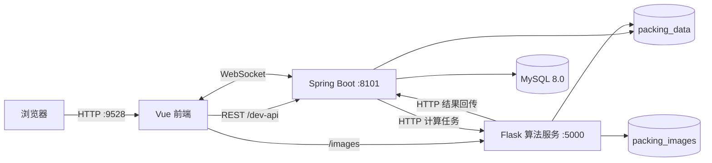

# Packing · 智能装箱系统

> 面向卷材、托盘和车厢场景的装箱计算与可视化平台。项目集成了业务管理、异步计算、三维结果展示、历史订单和 Excel 导入导出。


## 目录

- [项目简介](#项目简介)
- [核心功能](#核心功能)
- [系统架构](#系统架构)
- [仓库结构](#仓库结构)
- [Docker 快速启动](#docker-快速启动)
- [开发与测试](#开发与测试)
- [环境变量](#环境变量)
- [服务器部署要点](#服务器部署要点)
- [数据与备份](#数据与备份)
- [常见问题](#常见问题)
- [维护建议](#维护建议)

## 项目简介

Packing 是一套前后端与算法服务分离的装箱系统：

- **前端**：Vue 2 + Element UI + Three.js + ECharts GL，负责参数录入、结果展示和管理页面。
- **业务服务**：Spring Boot + MyBatis + WebSocket，负责用户、规格、任务、计算流程和实时结果推送。
- **算法服务**：Flask + NumPy/SciPy + rectpack，负责托盘装箱、悬空装箱、图片和 Excel 结果生成。
- **数据存储**：MySQL 8.0 保存用户、规格和任务元数据，Docker Volume 保存计算中间文件与结果资源。

## 核心功能

- 托盘装箱和悬空装箱两类计算流程。
- Excel 货物数据导入，支持密度、尺寸、卷数、重量和优先级等字段。
- 装满优先、混装、横放、膜叠膜、超出范围和托盘规格等约束配置。
- 计算前后端参数校验，包括膜叠膜高度和车厢高度边界。
- WebSocket 异步结果推送、心跳保活、超时检测和指数退避重连。
- 托盘/车厢三维结果、剩余货物、空间利用率和重量统计。
- 历史订单查询、配置回读、结果展示与订单数据导出。
- 用户、部门、车厢、托盘、卷材和纸筒等基础数据管理。

## 系统架构



### 默认端口

| 服务 | 容器端口 | 主机端口 | 用途 |
| --- | ---: | ---: | --- |
| `packing-frontend` | 9528 | 9528 | Web 界面与前端代理 |
| `packing-service` | 8101 | 8101 | REST API 与 WebSocket |
| `packing-python` | 5000 | 5001 | 装箱算法和 `/images` 静态资源 |
| `mysql` | 3306 | 33306 | 业务数据库 |

WebSocket 端点：

- `/palletpackingWebsocket`
- `/suspendpackingWebsocket`

## 仓库结构

```text
Packing/
├── deploy/
│   └── mysql/init.sql              # MySQL 初始表结构和本地演示数据
├── packing_service/                 # Spring Boot 业务服务
│   ├── src/main/
│   ├── src/test/
│   ├── Dockerfile
│   └── pom.xml
├── packing_service_frontend/        # Vue 2 前端与三维展示
│   ├── src/
│   ├── tests/unit/
│   ├── default.conf
│   ├── dockerfile
│   └── package.json
├── py3dbp/                          # Flask/Python 装箱算法
│   ├── rectpack/
│   ├── tests/
│   ├── api_test.py
│   ├── main.py
│   ├── suspend_algo.py
│   └── requirements.txt
└── docker-compose.local.yml         # 本地一键编排
```

## Docker 快速启动

### 1. 环境要求

- Docker Engine / Docker Desktop
- Docker Compose v2
- 建议可用内存 4 GB 以上
- 主机端口 `9528`、`8101`、`5001`、`33306` 保持空闲

> `docker-compose.local.yml` 当前将 MySQL 锁定为 `linux/arm64/v8`。x86_64/AMD64 服务器请删除该 `platform` 行，或调整为匹配的架构。

### 2. 启动

```bash
git clone https://github.com/56wj/Packing.git
cd Packing

docker compose -f docker-compose.local.yml up -d --build
docker compose -f docker-compose.local.yml ps
```

首次构建需要下载 Maven、npm 和 pip 依赖，耗时取决于网络和镜像缓存。

### 3. 访问

- Web 界面：<http://localhost:9528>
- 本地初始账号：`admin`
- 本地初始密码：`123456`

> 初始账号只用于本地启动验证。完成登录后请立即更换密码，生产环境同时替换 MySQL 密码。

### 4. 日常操作

```bash
# 查看全部日志
docker compose -f docker-compose.local.yml logs -f

# 查看单个服务日志
docker compose -f docker-compose.local.yml logs -f packing-service
docker compose -f docker-compose.local.yml logs -f packing-python
docker compose -f docker-compose.local.yml logs -f packing-frontend

# 重建并启动单个服务
docker compose -f docker-compose.local.yml up -d --build packing-frontend

# 停止容器，保留 Volume 数据
docker compose -f docker-compose.local.yml down

# 连同 Volume 一起清理（会清除本地数据库和计算结果）
docker compose -f docker-compose.local.yml down -v
```

## 开发与测试

### 前端

```bash
cd packing_service_frontend
npm install
npm run dev

# 单元测试
npm run test:unit

# 生产构建
npm run build:prod
```

### Spring Boot 服务

```bash
cd packing_service

# 测试
mvn test

# 打包
mvn clean package
```

开发环境使用 Java 8；Docker 启动时会自动激活 `application-docker.yml` profile。

### Python 算法服务

```bash
cd py3dbp
python3.8 -m venv .venv
source .venv/bin/activate        # Windows: .venv\Scripts\activate
pip install -r requirements.txt

python api_test.py
python -m unittest discover -s tests -v
```

## 环境变量

### Spring Boot

| 变量 | Docker 默认值 | 说明 |
| --- | --- | --- |
| `MYSQL_HOST` | `mysql` | MySQL 主机/容器服务名 |
| `MYSQL_PORT` | `3306` | MySQL 容器端口 |
| `MYSQL_DB` | `db_kindlead` | 数据库名 |
| `MYSQL_USER` | `root` | 数库用户 |
| `MYSQL_ROOT_PASSWORD` | `123456` | 本地编排密码，生产必须替换 |
| `PYTHON_API_HOST` | `http://packing-python` | 算法服务内网地址 |
| `PYTHON_API_PORT` | `5000` | 算法服务内网端口 |

### Python

| 变量 | Docker 默认值 | 说明 |
| --- | --- | --- |
| `INTERNAL_API_BASE_URL` | `http://packing-service:8101` | 算法结果回传地址 |
| `PUBLIC_ASSET_BASE_URL` | 空 | 图片/Excel 的公网前缀；为空时返回同源 `/images/...` |

### 前端

| 变量 | 作用 |
| --- | --- |
| `VUE_APP_BASE_API` | REST API 路径前缀，本地为 `/dev-api` |
| `VUE_APP_PROXY_TARGET` | REST API 代理目标 |
| `VUE_APP_WS_URL` | 显式 WebSocket 根地址；留空时使用当前页面 host |
| `VUE_APP_WS_PROXY_TARGET` | WebSocket 代理目标，默认回退到 `VUE_APP_PROXY_TARGET` |
| `VUE_APP_ASSET_PROXY_TARGET` | `/images` 图片和 Excel 代理目标 |
| `VUE_APP_HTTP_URL` | 兼容旧资源地址的基础 URL |

## 服务器部署要点

### 远程浏览器访问

当系统运行在服务器，用户从另一台电脑访问时，前端 WebSocket 建议走当前页面同源代理：

```yaml
environment:
  VUE_APP_WS_URL: ""
  VUE_APP_WS_PROXY_TARGET: http://packing-service:8101
```

显式配置 `ws://localhost:8101/` 时，`localhost` 代表访问者的电脑，并非部署服务器。

### Nginx 代理

生产环境建议执行 `npm run build:prod`，使用 Nginx 托管 `dist/`，并配置：

- `/prod-api/` 或约定的 API 前缀代理到 Spring Boot `8101`。
- `/palletpackingWebsocket` 和 `/suspendpackingWebsocket` 代理到 `8101`，保留 `Upgrade`/`Connection` 请求头。
- `/images/` 代理到 Python 服务 `5000`。
- HTTPS 页面对应 `wss://` WebSocket。
- WebSocket 代理读取超时建议高于后端的 `90s` idle timeout。

可参考 [`packing_service_frontend/default.conf`](packing_service_frontend/default.conf) 中的 WebSocket 配置。

### 生产安全

- 替换初始管理员密码与 MySQL 密码。
- 对外仅暴露 Nginx/HTTPS 入口，MySQL、Spring Boot 和 Python 使用内网或防火墙限制。
- 持久化日志、数据库和结果目录，并定期执行备份恢复演练。
- 生产前执行前端构建、后端测试和 Python 规则测试。

## 数据与备份

Docker Compose 创建三个持久化 Volume：

| Volume | 内容 |
| --- | --- |
| `mysql_data` | MySQL 数据文件 |
| `packing_data` | source/result/middle/push 等计算文件 |
| `packing_images` | 三维图片和 Excel 导出文件 |

查看实际 Volume 名称：

```bash
docker volume ls | grep packing
```

备份前建议暂停写入或创建数据库一致性快照。执行 `docker compose down -v` 前应先确认备份可用。

## 常见问题

### 1. 页面提示 WebSocket 连接失败

依次检查：

1. 浏览器实际连接的 host 是否为页面所在服务器。
2. `VUE_APP_WS_URL` 在远程部署时是否留空，或是否配置为真实的 `ws://`/`wss://` 地址。
3. Nginx/Vue devServer 是否代理两个 WebSocket 路径并保留 Upgrade 请求头。
4. `packing-service` 的 `8101` 端口和后端日志是否正常。

```bash
docker compose -f docker-compose.local.yml logs --tail=200 packing-service packing-frontend
```

### 2. Excel/图片导出失败

结果资源默认位于 `/images/<taskId>/...`。请确认：

- Python 服务已生成对应文件。
- `VUE_APP_ASSET_PROXY_TARGET` 指向 Python 服务。
- 生产 Nginx 将 `/images/` 代理到 `5000`。
- 请求响应是 Excel/图片，而非 SPA 的 `index.html`。

### 3. MySQL 启动或健康检查失败

```bash
docker compose -f docker-compose.local.yml logs --tail=200 mysql
docker compose -f docker-compose.local.yml exec mysql \
  mysqladmin ping -h 127.0.0.1 -uroot -p123456
```

如果更换了 `MYSQL_ROOT_PASSWORD`，同步更新 healthcheck 和 `packing-service` 的数据库环境变量。

### 4. 修改代码后容器仍运行旧版本

```bash
docker compose -f docker-compose.local.yml up -d --build --force-recreate packing-service packing-python packing-frontend
docker compose -f docker-compose.local.yml ps
```

构建后对照日志、容器启动时间和浏览器 Network 请求确认版本。

## 维护建议

单人维护时可以根据风险选择流程：

- README、注释、文案等低风险修改：通过测试后可直接提交到 `main`。
- 算法、数据库、部署、WebSocket 和大范围重构：建议使用短期功能分支和 PR，便于查看 diff、运行检查和回滚。

推荐的提交前检查：

```bash
(cd packing_service_frontend && npm run test:unit && npm run build:prod)
(cd packing_service && mvn test)
(cd py3dbp && python -m unittest discover -s tests -v)
```

---

如需排查部署问题，提供 `docker compose ps`、相关服务最近 200 行日志、浏览器 Network/Console 记录和完整启动命令。
